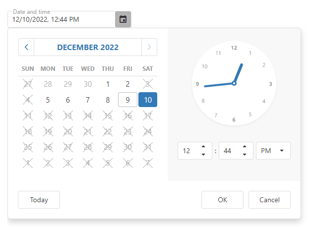

<!-- default badges list -->

<!-- default badges end -->
# DevExtreme DateBox - Getting Started 

This repository stores the code examples of the DateBox component for the [Getting Started with DateBox](https://js.devexpress.com/Documentation/Guide/UI_Components/DateBox/Getting_Started_with_DateBox/) tutorial. DateBox is a UI component that allows users to set a certain date, time, or date/time combination. This tutorial shows how to configure the basic DateBox features.

## Files to Review

- **Angular**
    - [app.component.html](Angular/src/app/app.component.html)
    - [app.component.ts](Angular/src/app/app.component.ts)
- **jQuery**
    - [index.js](jQuery/src/index.js)
- **React**
    - [App.tsx](React/src/App.tsx)
- **Vue**
    - [App.vue](Vue/src/App.vue)
    - [DateBoxContent.vue](Vue/src/components/DateBoxContent.vue)

## Documentation

- [Getting Started with DateBox](https://js.devexpress.com/Documentation/Guide/UI_Components/DateBox/Getting_Started_with_DateBox/)

- [DateBox - API Reference](https://js.devexpress.com/Documentation/ApiReference/UI_Components/dxDateBox/)
<!-- feedback -->
## Does this example address your development requirements/objectives?

 

(you will be redirected to DevExpress.com to submit your response)
<!-- feedback end -->
